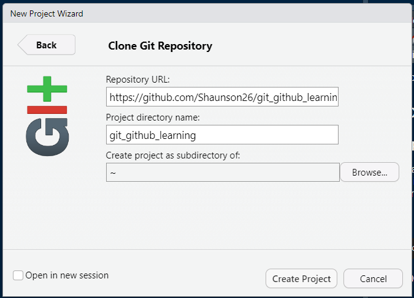

<!-- README.md is generated from README.Rmd. Please edit that file -->

```{r, include = FALSE}
knitr::opts_chunk$set(
  collapse = TRUE,
  comment = "#>",
  echo = FALSE
)
```

# git and github learning

<!-- badges: start -->
<!-- badges: end -->

A repository to practice git and github stuff with other people.

## Cloning a repo within RStudio

- Get the repo link from github

```{r, fig.align='center'}
knitr::include_graphics('readme-images/github-link.png')
```

- Go to RStudio
- File -> New Project ...
- Click 'Version control'

```{r, fig.align='center'}
knitr::include_graphics('readme-images/rstudio-version-control.png')
```

- Click 'git'
- Insert link

```{r, fig.align='center'}

```

- Done

```{r, fig.align='center'}
knitr::include_graphics('readme-images/rstudio-cloned-repo.png')
```