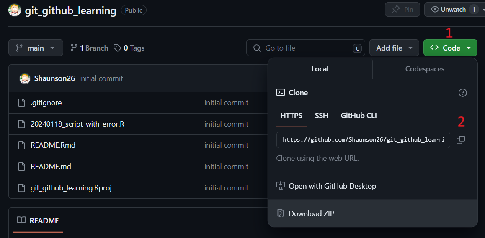
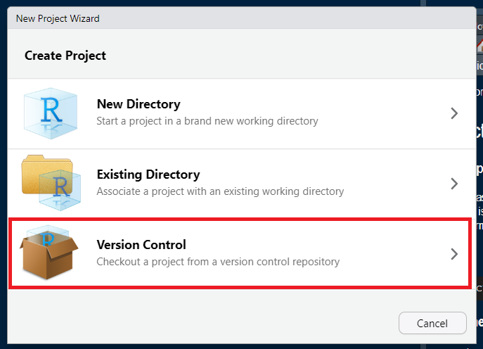
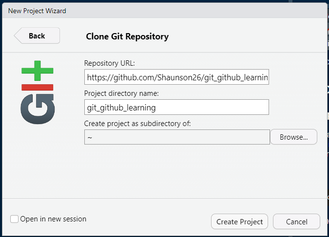
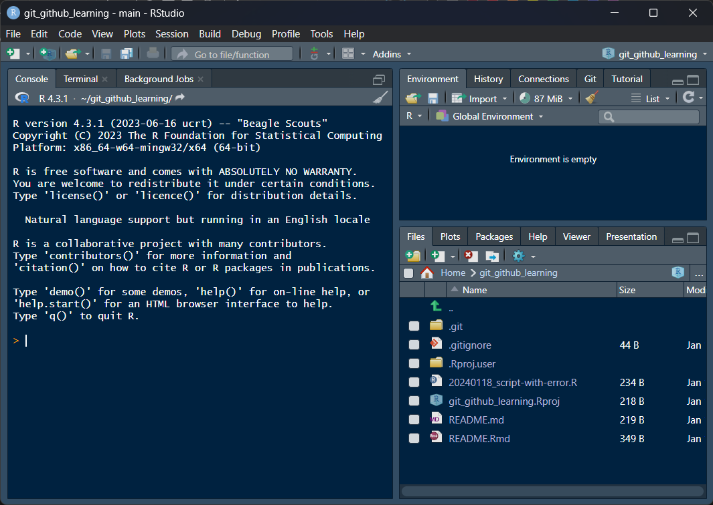

<!-- README.md is generated from README.Rmd. Please edit that file -->

# git and github learning

<!-- badges: start -->
<!-- badges: end -->

A repository to practice git and github stuff with other people.

## Cloning a repo within RStudio

- Get the repo link from github

- Go to RStudio
- File -\> New Project …
- Click ‘Version control’

- Click ‘git’
- Insert link

- Done

